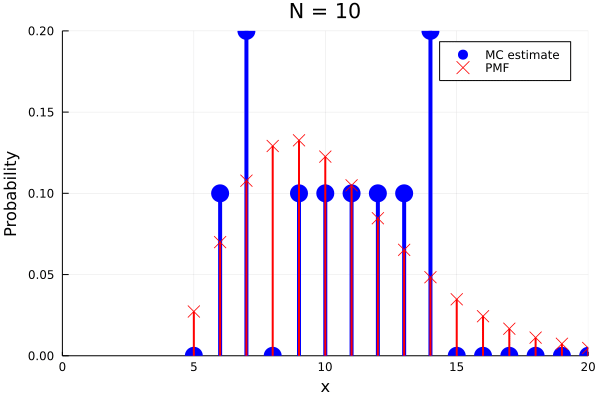

# Statistics with Julia From the Ground Up

This is a workshop prepared for [JuliaCon2021](https://juliacon.org/2021/).



In order to run the workshop make sure that you have Julia executable installed (it was tested under Julia 1.6.0).

One way to run the workshop is to run as follows:
1. Clone this [workshop repository](https://github.com/yoninazarathy/JuliaCon2021-StatisticsWithJuliaFromTheGroundUp) to a local folder on your computer (or download the zip file)
2. Start Julia in your local folder using the `julia` command.
3. If you don't have IJulia installed install it via,
```
] 
add IJulia
```
then hit backspace to exit the package manager.

4. Start Jupyter Notebook with:
```
using IJulia
notebook(dir=@__DIR__)
```
The first time you run `notebook` you may be asked if to install `conda`. Recommended to hit `y`.

5. In the Jupyter Notebook open the *Workshop.ipynb* file and run the first few cells. These cells will install the needed packages in the enviornment for the workshop.